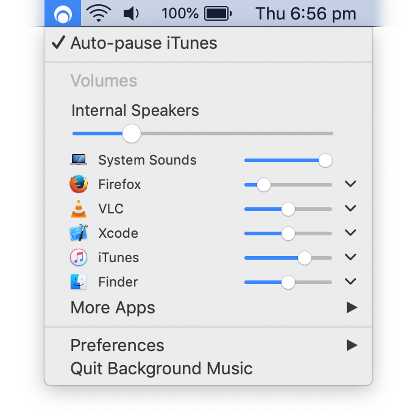

<!-- vim: set tw=120: -->

# Background Music
##### macOS audio utility

# SSCOTTH's FORK/BRANCH FOR UNOFFICIAL TRAVIS BUILDS 

* [ORIGINAL REPO](https://github.com/kyleneideck/BackgroundMusic)
* [LATEST RELEASE](https://github.com/sscotth/BackgroundMusic/releases/latest)
* [HOMEBREW TAP](https://github.com/sscotth/homebrew-backgroundmusic)
